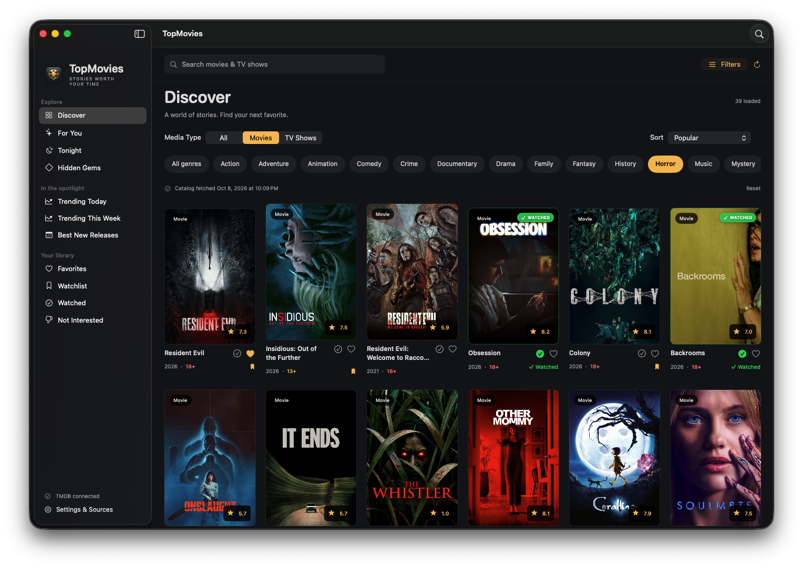

<p align="center">
  
</p>

<p align="center">
  <a href="#license"></a>
  <a href="https://developer.apple.com/macos/"></a>
  <a href="https://swift.org"></a>
  <a href="https://developer.apple.com/xcode/swiftui/"></a>
  <a href="#"></a>
  <a href="#"></a>
</p>

---

# TopMovies for Mac

**TopMovies** is an ultra-fast, privacy-first native macOS movie and TV series discovery application built with **SwiftUI** and **Swift 6**. 

Engineered with modern Apple design aesthetics, it offers deep filtering, curated discovery feeds, local library tracking, progressive pagination, and a complete offline demo mode—with **zero third-party dependencies**.

---

## 🌟 Key Features

- **🎬 Curated Discovery Feeds**:
  - **Discover**: Browse worldwide catalogs categorized across all major film and television genres.
  - **For You**: Deterministic, personalized recommendations based on your favorite genres and ratings (no AI/ML tracking).
  - **Tonight**: Smart time-bounded picker (default 120 minutes) excluding already watched titles.
  - **Hidden Gems**: Curated high-rated titles (rating $\ge$ 7.0) with moderate audience vote counts ($100 - 3,000$).
  - **Trending & Best New Releases**: Daily and weekly attention activity with verified audience participation.

- **🔍 Advanced Multi-Criteria Filters**:
  - Filter by media type (**All / Movies / TV Shows**).
  - Multi-country origin language matching and regional collection groupings.
  - Release date ranges, release year, or decade.
  - Minimum audience scores, vote thresholds, and runtime caps.
  - Conservative content filtering (explicit/adult content blocked by default, separate US motion picture and TV label hierarchies).

- **⚡ Progressive Paging & Resilience**:
  - Intelligent autofill pagination for sparse filter results without unbounded network loops.
  - Concurrency-limited detail fetching with automatic HTTP 429 rate-limit backoff.
  - 7-day catalog and poster snapshot caching, 6-hour video and season metadata reuse.

- **🔒 Local & Privacy-Conscious**:
  - **100% Local Library**: Favorites, Watchlist, Watched items, and personal 1–10 star ratings stay on your Mac.
  - **macOS App Sandbox**: Runs securely sandboxed.
  - **Keychain Security**: TMDB API Read Access Tokens are stored safely in macOS Keychain (`Security.framework`) and never logged or leaked.

- **📴 Complete Offline Demo Mode**:
  - Full demo catalog with procedural geometric poster artwork, fictional plots, cast, and scores when running without an API key.

---

## 🎨 Branding & Assets

| App Icon | Hero Showcase |
| :---: | :---: |
|  |  |

---

## 🚀 Getting Started

### System Requirements

- **Operating System**: macOS Sonoma (14.0) or later.
- **Hardware**: Apple Silicon (M1/M2/M3/M4) or Intel Mac (Universal Binary).
- **Development**: Xcode 15+ / Swift 6 toolchain.

### Quick Launch (Prebuilt App)

A review build is ready in the repository:

```bash
open build/TopMovies.app
```

### Build from Source

You can build and run using Xcode or via the terminal:

```bash
# 1. Clone the repository
git clone https://github.com/your-username/topMovies.git
cd topMovies

# 2. Run unit and integration tests
swift test

# 3. Build Release, sign locally, and launch
./scripts/run-mac.sh
```

For an unsigned development build:

```bash
xcodebuild -project TopMovies.xcodeproj \
           -scheme TopMovies \
           -destination 'platform=macOS' \
           -derivedDataPath build/mac \
           CODE_SIGNING_ALLOWED=NO build
```

---

## 🔑 Connecting Real TMDB Data

TopMovies works immediately out of the box with an illustrative offline catalog. To connect real-world movies and series:

1. Create a free account at [The Movie Database (TMDB)](https://www.themoviedb.org/).
2. Request a free **noncommercial** API key in your [TMDB Account Settings](https://www.themoviedb.org/settings/api).
3. Copy your **API Read Access Token** (v4 JWT token, not the short API key).
4. Launch TopMovies, open **Settings & Sources** (`⌘,`), paste into the token field, and click **Save & Connect**.

> [!NOTE]
> Your token is stored exclusively in the macOS Keychain. Removing the token at any time returns the app cleanly to Demo Mode without wiping your local library or preferences.

---

## ⌨️ Keyboard Shortcuts

| Shortcut | Action |
| :--- | :--- |
| `⌘ F` | Focus search bar |
| `⌘ R` | Refresh catalog & active feeds |
| `⇧ ⌘ F` | Toggle filter panel |
| `⇧ ⌘ 0` | Reset all active filters to default |
| `⌘ ,` | Open Settings & Sources |
| `Escape` | Dismiss modal details or settings sheet |

---

## 🏛️ Project Architecture

```
TopMovies/
├── TopMovies/
│   ├── App/            # Entry point (TopMoviesApp.swift) & State Store (AppStore.swift)
│   ├── Core/           # Domain Models, TMDBClient, ProgressivePaging, DemoCatalog
│   ├── Views/          # Native SwiftUI components (RootView, DetailView, PosterView, FilterPanel)
│   └── Resources/      # AppIcon.icns, TMDB branding, entitlements
├── Tests/              # 27 comprehensive unit and integration tests
├── docs/               # Architecture guides, data sources, and branding assets
├── scripts/            # CLI utilities, icon generation, project build helpers
└── Package.swift       # Swift Package Manager manifest for TopMoviesCore
```

For full details on concurrency patterns, caching mechanics, and data flow, see [docs/ARCHITECTURE.md](docs/ARCHITECTURE.md).

---

## 🤝 Contributing

Contributions are what make the open-source community an amazing place to learn, inspire, and create. Any contributions you make are **greatly appreciated**.

Please review our [Contributing Guidelines](CONTRIBUTING.md) and [Code of Conduct](CODE_OF_CONDUCT.md) before submitting pull requests.

1. Fork the Project
2. Create your Feature Branch (`git checkout -b feature/AmazingFeature`)
3. Commit your Changes (`git commit -m 'Add some AmazingFeature'`)
4. Verify tests pass (`swift test`)
5. Push to the Branch (`git push origin feature/AmazingFeature`)
6. Open a [Pull Request](.github/pull_request_template.md)

---

## 🛡️ Security & Privacy

If you discover any security issues, please review our [Security Policy](SECURITY.md) for instructions on how to report vulnerabilities privately.

---

## ⚖️ Content Policy & Attribution

- **TMDB Attribution**: This product uses the TMDB API but is not endorsed or certified by TMDB. The official TMDB logo and required notice are displayed in the application in compliance with TMDB terms.
- **Content Filtering**: Explicit/adult titles, NC-17, and TV-MA are excluded by default. R-rated titles are hidden unless explicitly enabled in content preferences.
- **License**: Application code and original demo artwork are licensed under the **[MIT License](LICENSE)**. TMDB branding, provider data, Apple frameworks, and third-party host content retain their respective terms and copyrights.
